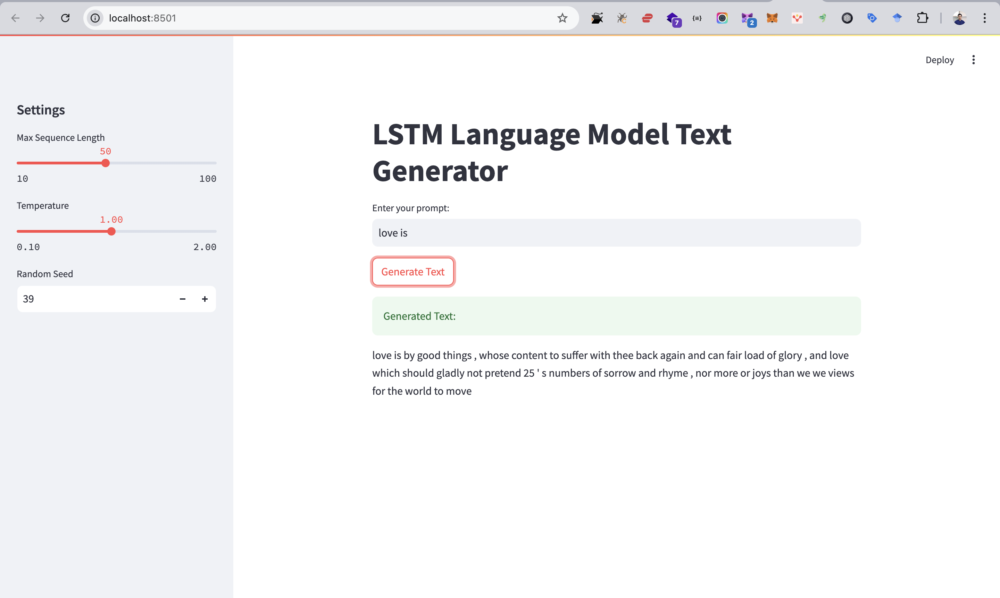

# NLP-A2-Language-Model-st125553
### Assignment 2: Language Model
#### AT82.05 Artificial Intelligence: Natural Language Understanding (NLU)

## GitHubLink:
-  https://github.com/Nyeinchanaung/NLP-A2-Language-Model-st125553 

## Content
- [Student Information](#student-information)
- [Files Structure](#files-structure)
- [How to run](#how-to-run)
- [Dataset](#dataset)
- [Model Training](#training)
- [Web Application](#application)

## Student Information
 - Name     : Nyein Chan Aung
 - ID       : st125553
 - Program  : DSAI

## Files Structure
1) The Jupytor notebook files
- st125553-LSTM-LM.ipynb
2) `app` folder  
- app.py (streamlit)
- `models` folder which contains four model exports and their metadata files.
 
## How to run
 - Clone the repo
 - Open the project
 - Open the `app` folder
 - `streamlit run app.py`
 - app should be up and run on `http://localhost:8501/`

## Dataset
- I am using the `Poetry Foundation Poems dataset` from Kaggle.
- The dataset was the collection of over 13,000 Poems from https://www.poetryfoundation.org.
- The dataset includes Title, Poem (body), Poet and Tag. I used Poem(body) to train the model.
- After cleaning the data, there are 91,020 rows of data.
- I split the data into 72816 rows for training, 9102 rows for each testing and validating in `DatasetDict`
- Kaggle Link: https://www.kaggle.com/datasets/tgdivy/poetry-foundation-poems.
- Credit To : https://www.poetryfoundation.org

## Training
### Preprocessing
The data preparation involves tokenizing the text using a basic English tokenizer, which splits text into words and handles punctuation.
1. The first step is to `tokenize` the text data, which involves splitting the text into individual tokens. Using the `get_tokenizer` function from `torchtext` returns a basic English tokenizer that splits text into words, converts them to lowercase, and handles punctuation.
2. Then build a vocabulary from the tokenized data. The vocabulary maps each token to a unique index.
3. The `get_data` function helps to convert tokens to indices and batching the data.
### Modeling
The `LSTMLanguageModel` is designed for language modelling tasks. It consists of:
1. **Embedding Layer**: Converts token indices into dense vectors of size `emb_dim`.
2. **LSTM Layer**: Processes the sequence of embeddings, with `num_layers` LSTM layers and a dropout rate for regularization.
3. **Dropout Layer**: Applies dropout to the LSTM outputs to prevent overfitting.
4. **Fully Connected Layer**: Maps the LSTM's hidden state to the vocabulary size (`vocab_size`) for token prediction.

The model includes methods for:
- **Weight Initialization**: Uniformly initializes the embedding, LSTM, and fully connected layer weights.
- **Hidden State Management**: Initializes and detaches hidden states for sequence processing.
- **Forward Pass**: Takes a sequence of token indices (`src`) and hidden states, and returns predictions for the next token and updated hidden states.

### Training and evaluation
The **training and evaluation** process for the LSTM language model involves two main phases. 
1. During **training**, the model is set to training mode, and hidden states are initialized and detached for efficiency. The data is truncated to ensure it can be divided evenly into sequences of a specified length (`seq_len`). For each batch, the optimizer’s gradients are zeroed, and input (`src`) and target (`target`) sequences are extracted. The model predicts the next token and the loss is computed using a criterion like cross-entropy. Gradients are clipped to prevent exploding gradients, and the optimizer updates the model parameters. The loss is accumulated and averaged over all batches for the epoch. 
2. During **evaluation**, the model is set to evaluation mode, and the same data truncation and batch processing steps are followed but without gradient computation or parameter updates. The evaluation loss is calculated to assess the model’s performance on unseen data. This process ensures effective learning while preventing overfitting and gradient instability.
### Testing
The testing step is to initialize the model with the pre-trained weights to evaluate or continue training. This aims to evaluate the model's performance on the test data by computing the loss, which measures how well the model predicts the next token. After calculating the perplexity result, print the test perplexity as a measure of model performance.
### Result
- **Train Perplexity:** 162.631 

This indicates how well the model performs on the training data. A lower perplexity means the model is better at predicting the next token in the training set.

- **Validation Perplexity:** 232.081 

This measures the model’s performance on the validation set, which is used to tune hyperparameters and prevent overfitting. The higher perplexity compared to the training set suggests some overfitting, as the model performs worse on unseen validation data.

- **Test Perplexity:** 227.200 

This reflects the model’s performance on the test set, which represents completely unseen data. The test perplexity is slightly better than the validation perplexity, indicating that the model generalizes reasonably well to new data.

## Application
### The web application 
The web application is built using `Streamlit`, a Python framework for creating interactive web apps. It provides a user-friendly interface for generating text using a pre-trained LSTM-based language model. Users can input a text prompt, adjust generation parameters, and view the generated text in real-time.
### LSTM language model
The application's backend interfaces with the LSTM language model to generate text. The pre-trained LSTM model and vocabulary are loaded into memory when the app starts. The user’s input prompt is tokenised into individual tokens (e.g., "love is" -> ["love", "is"]), and each token is mapped to its corresponding index in the vocabulary.
The tokenized prompt is fed into the LSTM model and the model generates text autoregressively, predicting one token at a time. The generated token indices are mapped back to words using the vocabulary and the final text is displayed to the user.
### Screenshot

